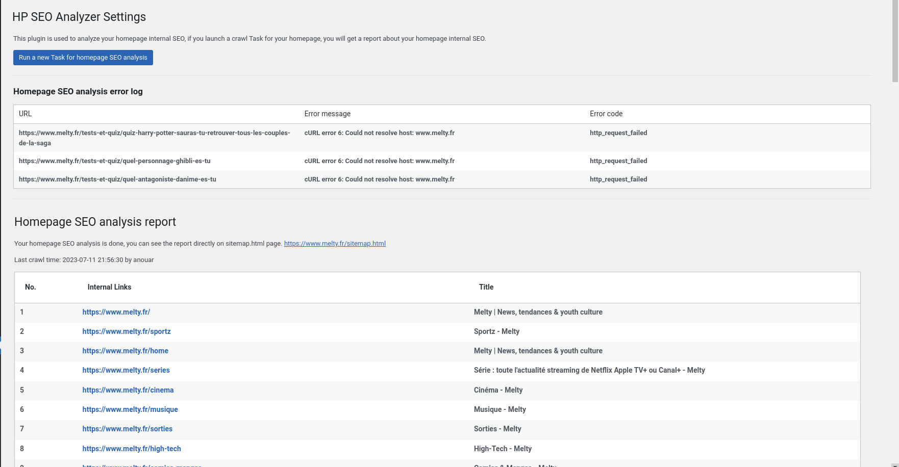
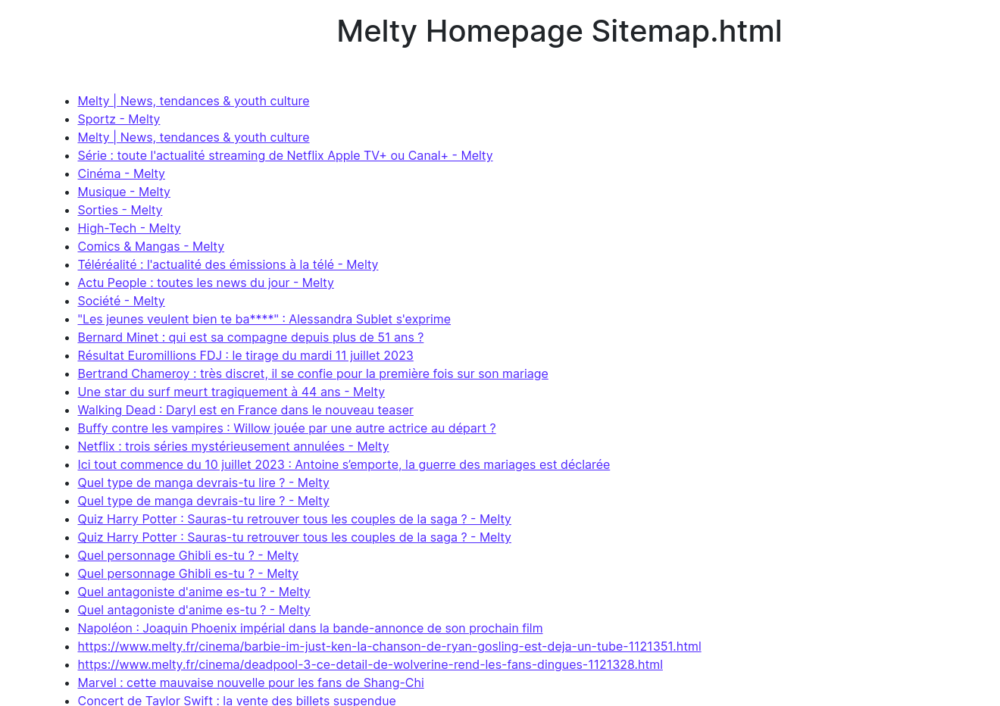

# Explanation.md (HomePage Internal SEO analyzer)

This plugin is a tool to help you generate a sitemap.html for your HomePage, and have a internal links of your HomePage.
what are the required functionalities in the plugin?

- Settings page for basic control
- Generate a /sitemap.html for your HomePage
- Mention the errors in the SEO of your HomePage
- Add scheduled task to update the sitemap.html every hour
now we will explain the thought process of building the plugin, and how it works.

## Setting Page

The setting page is a page where you can do the following:

- Generate a sitemap.html for your HomePage
- If a sitemap.html is already generated, you can update it
- See the errors in your internal links of your HomePage
- See the internal links of your HomePage that are listed in the sitemap.html

this is how the setting page looks like:

### Homepage Crowling process

- For the crowling of the links, i used the wordpress function `wp_remote_get()` since it's fast, secure and doesn't require any extra libraries.
- The error handing is implemented and we log the errors into an option in the database. so that we can review them later.
- After crowling The homepage html, we use `DOMDocument` to parse the html and get the links, then filter the internal links. then we save the links in a `transient` for 7 days and make a permanent copy in an option in the database.

### Sitemap.html

I do not agree on storing the sitemap.html in a file, since it will require a direct permission on the main directory of wordpress (which is not a good security practice) 
if we want to use a file, it will be better either to store it in the uploads directory or we ask the user to create a directory in the main directory of wordpress and store it there.

in conclusion these will be the inconveniences of storing the sitemap.html in a file: 
- Security issues (direct permission on the main directory of wordpress)
- The user should have a direct access to the server to create the file
- The user should have knowledge of file permissions and how to set them

so i decided to use a similar approch on directly accessing the file in the server but without the inconveniences of storing the file in the main directory of wordpress. by checking the server request uri and if it's equal to the sitemap.html, we will directly output the sitemap.html file. 

when the user requests the sitemap.html, we get the sitemap.html from the database and output it directly to the user.

this is how the sitemap.html looks like:

